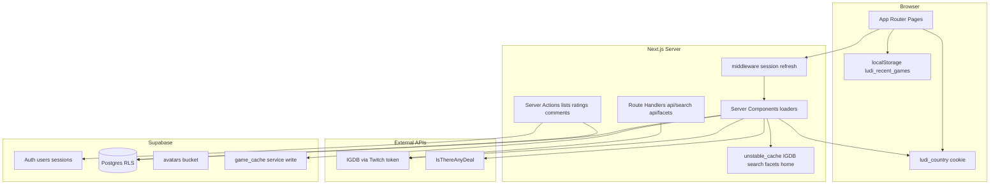

# Ludi v1 — Full Implementation Plan

## 1. Current state assessment


| Area       | Exists                                                                                                                                                                                                                                      | Missing                                                                          |
| ---------- | ------------------------------------------------------------------------------------------------------------------------------------------------------------------------------------------------------------------------------------------- | -------------------------------------------------------------------------------- |
| App shell  | [src/app/layout.tsx](src/app/layout.tsx), [src/app/page.tsx](src/app/page.tsx) (Create Next App template), [src/app/globals.css](src/app/globals.css) (basic `--background`/`--foreground`)                                                 | All product routes, nav, tokens file                                             |
| Data / API | —                                                                                                                                                                                                                                           | `src/lib/igdb`, `src/lib/itad`, `src/lib/game`, Supabase clients, Route Handlers |
| Auth       | `@supabase/ssr` + `@supabase/supabase-js` in [package.json](package.json)                                                                                                                                                                   | `middleware.ts`, auth pages, callback, profile bootstrap                         |
| Database   | Supabase MCP wired ([.cursor/mcp.json](.cursor/mcp.json), project `urqgmuieboqwommrxsxj`)                                                                                                                                                   | No `supabase/migrations/`; schema not in repo                                    |
| Specs      | Complete under [.cursor/skills/](.cursor/skills/)                                                                                                                                                                                           | Implementation                                                                   |
| Env        | [.env.example](.env.example) documents variable names; [.env.local](.env.local) exists at repo root (sibling) with values populated — gitignored (`.env*` in [.gitignore](.gitignore)), so agents cannot read secrets; reference names only |                                                                                  |


**Installed but unused in v1:** `lenis` — do not import.

**Next.js 16 note:** [AGENTS.md](AGENTS.md) requires consulting current Next 16 docs before coding (`node_modules/next/dist/docs/` may be absent in this install — use [nextjs.org/docs](https://nextjs.org/docs) for App Router, `middleware`, `unstable_cache`, Route Handlers, and React 19 / React Compiler conventions). [next.config.ts](next.config.ts) already enables `reactCompiler: true`.

---

## 2. Architecture




**Request patterns**

- **Public read:** home discovery, search (requires `q`), game detail (IGDB + cache + ITAD; community read).
- **Authed write:** lists, play status, ratings, comments (email verified for comment/rate), avatar upload, settings.
- **Service role only:** `game_cache` upsert.

**Country resolution (ITAD):** `profiles.preferred_country` → cookie `ludi_country` → `Accept-Language`/geo hint → `US`.

---

## 3. Target file / folder tree

```
src/
  app/
    layout.tsx                    # Nav + tokens + metadata
    globals.css                     # @import tokens
    page.tsx                        # Home
    search/page.tsx
    game/[igdbId]/page.tsx
    profile/page.tsx
    list/[listId]/page.tsx
    settings/page.tsx
    login/page.tsx
    signup/page.tsx
    forgot-password/page.tsx
    terms/page.tsx
    privacy/page.tsx
    auth/callback/route.ts
    auth/reset-password/page.tsx
    api/search/route.ts
    api/facets/route.ts             # optional; or inline in search loader
  components/
    nav/SiteNav.tsx
    game-card/GameCard.tsx
    game-card/AddToListMenu.tsx
    game/                        # section components (hero, buy, about, ...)
    search/                      # filters, quick pills, load more
    profile/
    list/
    ui/                          # shadcn primitives
  lib/
    supabase/client.ts
    supabase/server.ts
    supabase/middleware.ts
    igdb/auth.ts
    igdb/client.ts
    igdb/game-type-ids.json
    igdb/facets/                 # cached JSON or fetch helpers
    igdb/images.ts
    itad/client.ts
    game/types.ts
    game/normalize.ts
    game/load-game-page.ts
    game/composite-rating.ts
    game/recent-games.ts          # localStorage helpers (client)
    search/build-query.ts
    search/search-games.ts
    lists/actions.ts              # Server Actions
    lists/sync.ts
    auth/validation.ts            # next param sanitizer
    country/resolve-country.ts
    env.ts                        # assert required process.env (no secret logging)
  styles/design-tokens.css
  types/database.ts               # generated from Supabase MCP
middleware.ts
scripts/generate-game-type-ids.ts
supabase/migrations/              # committed when stable
  001_initial_schema.sql
  002_rls_policies.sql
  003_storage_avatars.sql
```

---

## 4. Phased implementation

### Phase 0 — Foundation

**Goal:** Runnable shell with design system, Supabase wiring, IGDB auth helper, legal stubs.


| Task             | Details                                                                                                                                                                                                                                                                                          |
| ---------------- | ------------------------------------------------------------------------------------------------------------------------------------------------------------------------------------------------------------------------------------------------------------------------------------------------ |
| Design tokens    | Create [src/styles/design-tokens.css](src/styles/design-tokens.css) per [ludi-decisions](.cursor/skills/ludi-decisions/SKILL.md) (`--surface`, `--accent`, `color-scheme: light dark`); map in [globals.css](src/app/globals.css) via `@theme`                                                   |
| Supabase SSR     | `src/lib/supabase/{client,server,middleware}.ts` per `@supabase/ssr` Next.js pattern; [middleware.ts](middleware.ts) at repo root                                                                                                                                                                |
| Route protection | `/profile`, `/settings`, `/list/`* require session; `/login`, `/signup` redirect if authed; validate `next` same-origin ([ludi-auth](.cursor/skills/ludi-auth/SKILL.md))                                                                                                                         |
| Site nav         | [ludi-components-nav](.cursor/skills/ludi-components-nav/SKILL.md): logo, Home, search form → `/search?q=`, Login vs avatar+username (`md+`)                                                                                                                                                     |
| IGDB token       | `src/lib/igdb/auth.ts` + `client.ts`: Twitch client_credentials, ~50min cache, single 401 retry                                                                                                                                                                                                  |
| Game type IDs    | `scripts/generate-game-type-ids.ts` → `src/lib/igdb/game-type-ids.json` (run once; uses existing `.env.local`)                                                                                                                                                                                   |
| Env validation   | `src/lib/env.ts` (or dev-only route): assert required vars from `.env.example` are defined at runtime (`IGDB_CLIENT_ID`, `IGDB_CLIENT_SECRET`, `ITAD_API_KEY`, `NEXT_PUBLIC_SUPABASE_URL`, `NEXT_PUBLIC_SUPABASE_ANON_KEY`, `SUPABASE_SERVICE_ROLE_KEY`) — boolean checks only, never log values |
| Stubs            | `/terms`, `/privacy` minimal pages                                                                                                                                                                                                                                                               |
| shadcn init      | Add only needed primitives: Button, Input, Label, Dialog, DropdownMenu, Select, Slider, Sheet (mobile filters)                                                                                                                                                                                   |


**Phase 0 done when:** App loads with nav on all pages; middleware runs; env validation passes; IGDB token fetch works in a smoke script or route.

---

### Phase 1 — Database and auth

**Goal:** Schema + RLS + signup bootstrap + full auth UX + settings + avatar storage + Server Action stubs.

**Schema (via Supabase MCP `execute_sql` / `apply_migration`, then commit migrations):**


| Table              | Notes                                                                                          |
| ------------------ | ---------------------------------------------------------------------------------------------- |
| `profiles`         | `id`, `username`, `avatar_url`, `preferred_country`, `created_at` — username **not** unique v1 |
| `user_lists`       | system + custom; `system_key` unique per user                                                  |
| `list_items`       | `sort_order`, optional platform fields; unique `(list_id, igdb_id)`                            |
| `user_game_status` | PK `(user_id, igdb_id)`; `play_status` enum                                                    |
| `game_ratings`     | unique `(user_id, igdb_id)`; score 0–10                                                        |
| `game_comments`    | `body`, `deleted_at` soft delete                                                               |
| `game_cache`       | `igdb_id` PK, `payload` jsonb, `steam_appid`, `fetched_at` — **no public write**               |


**RLS:** Owner CRUD on user tables (`user_id = auth.uid()` with `TO authenticated` + `USING`/`WITH CHECK`); `profiles` public read limited columns; `game_cache` SELECT for authenticated/service patterns as designed (writes via service role only).

**Bootstrap:** On `auth.users` insert — DB trigger or server action after signup: create `profiles` (username from email local-part sanitized 3–24), four system lists ([ludi-data-lists](.cursor/skills/ludi-data-lists/SKILL.md)), seed `preferred_country` from `ludi_country` cookie if set.

**Auth pages:** `/login`, `/signup`, `/forgot-password`, `/auth/callback`, `/auth/reset-password` — email+password, Google OAuth, signup terms line (no checkbox), default redirects `/` vs `/profile`.

**Settings:** `/settings` — read-only email, change password, `preferred_country` dropdown.

**Storage:** `avatars` bucket, 2MB, image types; RLS policies for owner upload/read.

**Server Actions (skeleton):** `setPlayStatus`, `addToList`, `removeListItem`, `rateGame`, `postComment`, `createList`, `renameList`, `deleteList`, `reorderListItems`, `updateProfile` — each enforces limits (10k items/list, 100 custom lists) and **email_confirmed_at** gate on rate/comment.

**Generate types:** Supabase MCP `generate_typescript_types` → `src/types/database.ts`.

**Phase 1 done when:** Signup creates profile + system lists; login/OAuth/reset work; middleware blocks guests from profile; avatar upload updates profile; unverified user cannot rate/comment server-side.

---

### Phase 2 — Shared components

**Goal:** Reusable GameCard + AddToListMenu + nav integration.


| Component         | Spec source                                                                                                                                   |
| ----------------- | --------------------------------------------------------------------------------------------------------------------------------------------- |
| `GameCard`        | [ludi-components-game-card](.cursor/skills/ludi-components-game-card/SKILL.md) — bookmark overlay, numeric rating pill, link `/game/[igdbId]` |
| `AddToListMenu`   | Custom instant uncheck; status lists read-only uncheck; `games_rated` read-only when rated                                                    |
| `GameCardPayload` | Shared type in `src/lib/game/types.ts`                                                                                                        |


Configure `next.config.ts` `images.remotePatterns` for `images.igdb.com`.

**Phase 2 done when:** GameCard renders from mock payload; save button opens menu or redirects guest to login; `isSaved` reflects Supabase state.

---

### Phase 3 — Search

**Goal:** URL-gated search with filters, sort, Load more.


| Piece             | Details                                                                                                                                                      |
| ----------------- | ------------------------------------------------------------------------------------------------------------------------------------------------------------ |
| `GET /api/search` | Build Apicalypse from [ludi-data-search](.cursor/skills/ludi-data-search/SKILL.md); `limit+1` → `hasMore`; `unstable_cache` 5–15min keyed by full param hash |
| Facets            | Cache platforms/genres/game_modes 24h (`/api/facets` or module)                                                                                              |
| `/search`         | No `q` → empty state only (no cards); with `q` → sidebar + quick pills (default Main games) + sort + grid + Load more client append                          |
| Navbar            | Submit min 2 chars; sync input when on `/search`                                                                                                             |


**Phase 3 done when:** `/search` without `q` shows hint only; with `q` returns cards; Load more appends; filters update URL and refetch.

---

### Phase 4 — Game data layer + page

**Goal:** Richest page — loader, cache, all six sections + sticky nav.

**Data layer** ([ludi-data-game](.cursor/skills/ludi-data-game/SKILL.md)):

- `loadGamePage(igdbId, country)` — read `game_cache` if fresh (<24h); else IGDB A (+B/D optional) parallel, normalize, upsert cache (service role)
- ITAD lookup + prices (shorter cache than IGDB)
- Query C related cards (≤50 IDs, priority order)
- `avg(game_ratings.score)` for Ludi average
- `compositeRating()` — exclude `total_rating`

**Page** ([ludi-pages-game](.cursor/skills/ludi-pages-game/SKILL.md)):

- Sticky pills: Buy · About · Community · Related · Next
- Hero: static cover + carousel/lightbox, status+platform, add to list, ratings, ITAD price
- Where to buy: region selector, ITAD table / mobile cards, store links
- About: anchored subsections; accessibility placeholder
- Community: comments + 0–10 slider step 0.5; verification gate UI
- Related: carousels per bucket; Mods section always visible + Nexus static link
- What's next: similar + localStorage recent (exclude current game)
- `generateMetadata` + OG image from cover
- `Suspense` + skeletons per section

**Phase 4 done when:** Valid `igdbId` renders all sections; 404 on miss; cache reduces repeat IGDB load; region change refetches ITAD; verified user can rate/comment.

---

### Phase 5 — Home, profile, list


| Route            | Spec                                                                                                                                                                                                                                |
| ---------------- | ----------------------------------------------------------------------------------------------------------------------------------------------------------------------------------------------------------------------------------- |
| `/`              | [ludi-pages-home](.cursor/skills/ludi-pages-home/SKILL.md) — hero search CTA, authed library rows (6 cards), recent from localStorage, New releases + Top rated (`unstable_cache` 24h), guest CTA — **no** unsolicited catalog grid |
| `/profile`       | [ludi-pages-profile](.cursor/skills/ludi-pages-profile/SKILL.md) — avatar, username inline edit, system lists order, previews, New list modal                                                                                       |
| `/list/[listId]` | [ludi-pages-list](.cursor/skills/ludi-pages-list/SKILL.md) — `@dnd-kit` reorder, long-press on touch, remove matrix + confirm for status lists, custom rename                                                                       |


**Phase 5 done when:** Home discovery cached; profile previews link to list pages; drag reorder persists `sort_order`; status list remove clears hero status on revalidation.

---

### Phase 6 — Polish and verification

- `revalidatePath` / tags after list remove, rate, status change
- `prefers-reduced-motion`: disable Framer transitions; carousel instant swap
- IGDB concurrency: batch IDs, max 2 parallel home calls, debounce search client
- `npm run build` clean
- Run Supabase MCP `get_advisors` after RLS migration
- Manual test pass (section 7)

---

## 5. Dependencies to add

```bash
npm install @dnd-kit/core @dnd-kit/sortable @dnd-kit/utilities
# shadcn: npx shadcn@latest init (Tailwind v4 compatible flags per current CLI --help)
```

Do **not** add Lenis usage. Keep Framer Motion for light scroll-reveal only.

**next.config.ts additions:** `images.remotePatterns` for IGDB; optional `experimental` only if Next 16 docs require for external images.

---

## 6. Risk register


| Risk                               | Mitigation                                                                                   |
| ---------------------------------- | -------------------------------------------------------------------------------------------- |
| IGDB 4 req/s                       | Batch related IDs (≤50); parallelize only independent calls; cache search + home 24h/5–15min |
| Language filter incomplete         | Document v1 limitation in search UI; defer server-side language filter to v1.1               |
| Email verification UX              | Mirror gate in Server Actions + disabled UI with resend link; test with unverified test user |
| RLS silent failures                | SELECT policies on all UPDATE tables; run `get_advisors`; test as wrong user                 |
| `game_cache` stale partial payload | On read, validate payload shape; refetch if incomplete                                       |
| Username collisions v1             | Accepted per spec; no DB unique until v1.1                                                   |
| Next.js 16 API drift               | Read current docs before middleware/Route Handler patterns                                   |
| Data API table exposure            | After migration, verify table grants if REST client reads fail                               |


---

## 7. Definition of done (consolidated)

**Auth:** Email + Google; reset flow; `next` safe; signup → `/profile`; derived username; terms links; middleware protection.

**Lists:** 4 system lists on signup; play status sync; platform required; rating → `games_rated`; limits enforced; AddToListMenu rules; list reorder mobile long-press.

**Search:** Gated on `q`; Main games default; Load more + `hasMore`; facets cached; no search without query.

**Game:** Six sections + sticky nav; `game_cache` 24h; ITAD region chain; community gated by verification; related ≤50; Nexus static link only; recent in localStorage.

**Home:** No raw catalog; discovery 24h cache; authed rows; guest CTA.

**Profile/Settings:** Avatar upload; username edit; list previews; preferred country.

**Global:** Tokens + light/dark; nav username `md+`; native scroll; build passes; no v1.1 features.

---

## 8. Manual test plan

1. **Guest:** Browse `/`, `/search` (empty), search with `q`, open game page, cannot save/rate/comment (redirect or disabled).
2. **Signup:** Email account → lands `/profile` → four system lists exist → username derived.
3. **Google OAuth:** Round-trip → profile exists.
4. **Unverified:** Login → game page → comment/rate blocked UI + server rejection.
5. **Verify email:** Rate with 0.5 steps → appears in `games_rated` → Ludi avg updates.
6. **Play status:** Set Playing + platform → `currently_playing`; switch to Played → moves list; None clears.
7. **Custom list:** Add via GameCard menu; uncheck removes instantly; hit 10k limit message (spot-check with mocked limit if impractical).
8. **List page:** Reorder desktop + long-press mobile; remove from status list → confirm → hero shows None after refresh.
9. **Search:** Load more appends; changing sort resets; filters in URL.
10. **Game:** Region change updates prices; sticky nav scrolls; lightbox a11y; 404 bad id.
11. **Home:** Guest sees CTA; authed sees library rows; New/Top rated load.
12. **Settings:** Change country → ITAD prices follow on game page.
13. **Build:** `npm run build` succeeds.

---

## 9. Environment and prerequisites

`**.env.local` is already configured** at the repo root, sibling to [.env.example](.env.example). Next.js loads it automatically for `next dev` and `next build`. It is excluded from git (`.env`* in [.gitignore](.gitignore), with `!.env.example` only) — agents and repo tools cannot read its values; that is expected, not missing setup.

**Do not:** commit `.env.local`, log secret values, or ask the user to copy `.env.example` unless runtime validation reports a missing variable.

**Reference only these names** (from `.env.example`):


| Variable                        | Scope                               |
| ------------------------------- | ----------------------------------- |
| `IGDB_CLIENT_ID`                | Server                              |
| `IGDB_CLIENT_SECRET`            | Server                              |
| `ITAD_API_KEY`                  | Server                              |
| `NEXT_PUBLIC_SUPABASE_URL`      | Client + server                     |
| `NEXT_PUBLIC_SUPABASE_ANON_KEY` | Client + server                     |
| `SUPABASE_SERVICE_ROLE_KEY`     | Server only — never `NEXT_PUBLIC_`* |


**Runtime checks (Phase 0):** Verify each name is defined via `process.env` (e.g. `src/lib/env.ts` `assertEnv()`). If a variable is undefined, fail fast with a clear message naming the missing key — do not pause implementation preemptively or request keys from the user when `.env.local` is assumed present.

**Supabase:** Project linked via MCP ([.cursor/mcp.json](.cursor/mcp.json), ref `urqgmuieboqwommrxsxj`). Use `list_tables` before migrations to avoid duplicating existing schema.